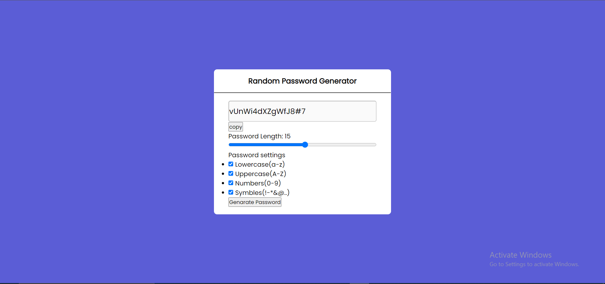

# Random password generator

## Netlify Deploy:

## Please visit the live site to check the app

```
https://rococo-cranachan-673e8f.netlify.app

```

<h1 style="text-align:center">Screen Shots</h1>


## Functions:

1. Lower case (a-z).
2. Heigher case (A-Z).
3. Symbles (!@#$%&\*).
4. Numbers.

## Buttons:

# 1. Copy-Paste:

### The copy paste button copy the given password to the clipboard.

# 2. Generate-password:

### Generate password generate the password according to the requirments.

<br><br><br><br>

# Author

## Gazi Ehsanul Haque

## American International University Bangladesh

## +8801869694519

<div>
<span><span>
<span><span>
</div>
